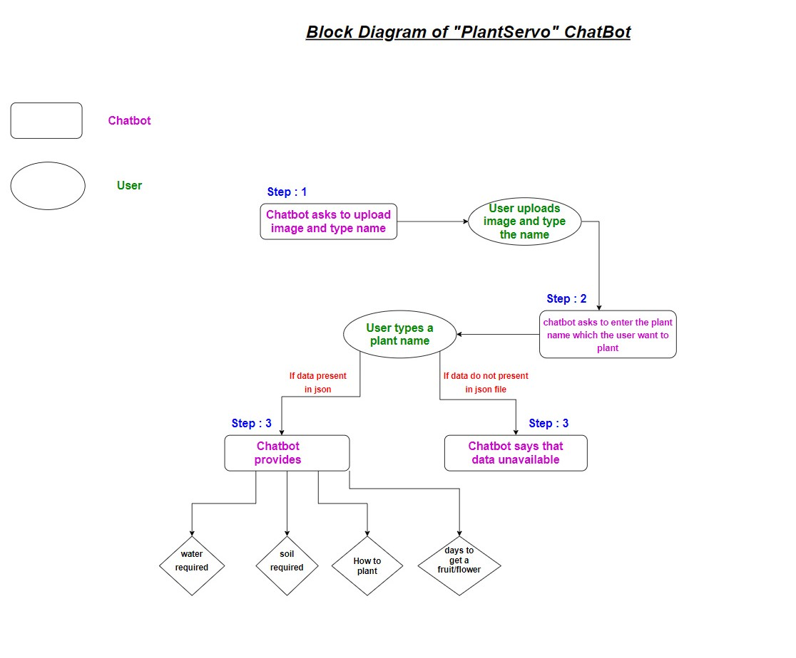

# ML2021_Project2
A simple chatbot using HTML, CSS, JAVASCRIPT and JSON as mock data

# Team Mates 
- Chinthalapudi Satya Rama Tulasi **(18pa1a0533)**
- Chilakala Baby Navya **(18pa1a0426)**
- Chilakala Bala Mahesh **(19pa1a0534)**

# Documentation on how to use Chatbot
## Steps to use bot:
- *Open the [PlantServo Chatbot](https://trickysecondhandfactor.tulasi533.repl.co).*
- *Type **your name** and **upload your image**.*
- *Type the **plant name** you want to grow*
- *Chat bot provides options like*
  - **Required water** shortform = water
  - **Required soil** shortform = soil
  - **How to plant** shortform = how
  - **Days to get a fruit/ flower** shortform = days
- *Enter the option with shortform mentioned above*
  - Chatbot gives info.
  
# Demo Video of this Chatbot

# Block Diagram of the Chatbot

# Play with the chatbot using below link
[PlantServo Chatbot](https://trickysecondhandfactor.tulasi533.repl.co/)

# Tools and Computer languages that I used for this Chatbot
- VSCode for IDE
- repl.it
- HTML, CSS, Java Script
- Json used for mock data

# References
- [For Java Script Syntax and how to use](https://www.w3schools.com/js/DEFAULT.asp)

**Thank You!!!!!**
